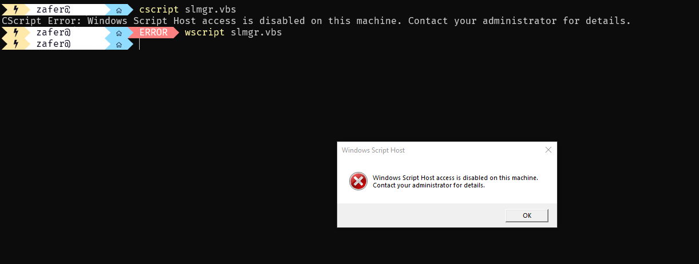

# slmgr-ps

A drop in replacement for slmgr script

**NB:** Currently the features are limited to KMS scenarios.

## Usage

### Installation

```powershell
Install-Module slmgr-ps
```

### `Start-WindowsActivation` cmdlet
```powershell
Start-WindowsActivation -WhatIf

# Activates the local computer
Start-WindowsActivation -Verbose

# Activates the computer named WS01
Start-WindowsActivation -Computer WS01

# Disabled the KMS cache for the computers named WS01 and WS02. Cache is enabled by default.
Start-WindowsActivation -Computer WS01, WS02 -CacheEnabled $false

# Activates the computer named WS01 against server.domain.net:2500
Start-WindowsActivation -Computer WS01 -KMSServerFQDN server.domain.net -KMSServerPort 2500

# ReArm the trial period. ReArming already licensed devices can break current license issues.
# Guard clauses wil protect 99% but cannot guarantee 100%.
Start-WindowsActivation -ReArm
```

### `Get-WindowsActivation` cmdlet
```powershell
# Collects basic license information of local computer, equal to slmgr.vbs /dli
Get-WindowsActivation

# Collects extended license informationof local computer, equal to slmgr.vbs /dlv
Get-WindowsActivation -Extended

# Collects basic license information of computer WS01 over WinRM
Get-WindowsActivation -Computer WS01

```
## About this module

One of my hardening guideline is getting rid of vbscript in every environment.
- I disabled `wscript` and `cscript` executables.


- I changed the file-type association of `.vbs` to be opened with Notepad, and cannot be executed.


This caused me being unable to use `slmgr.vbs`, `OSPP.vbs`, some SCCM features like MDT. I started with `slmgr.vbs` as it was more important for me; I was migrating Windows 7 devices to Windows 10!

I wrote a PowerShell script based on the `slmgr.vbs`. It's long but easy to read. You can find the old script in [my gists](https://gist.github.com/zbalkan/4ba92656a3a8387e6b220bcf8fcd5fc6).

I converted this simple, one-cmdlet script to a module and published it so anyone can use it easily.

### How?

If you need to activate a computer license, you had to:
- Find the key for your product
- Type `slmgr.vbs /ipk <5x5 key for the product>`
- Type `slmgr.vbs /ato`
- Repeat the same for each host locally

With this module, you trigger the activation by just typing `Start-WindowsActivation -Computer <array of hostnames>` remotely if WinRM is configured on the target. Or you can just do the same locally with `Start-WindowsActivation`.

With `Get-WindowsActivation`, you can get similar results like `slmgr.vbs /dli` and `slmgr.vbs /dlv` but with the strength and flexbility of Powershell.

### The differences from `slmgr.vbs`

- You can provide an array of computer names, and it is up to you how you get them. It's just PowerShell.
- It works on PowerShell version 5.0 and above. It means PowerShell 7.0 is ok, too.
- It uses WinRM for remote computers. Check if remote computers are accessible over WinRM.
- It includes a list of KMS keys, so that you don't have to for most of them. It covers some of the versions though, not all of them.
- It works even if you disabled `cscript` and `wscript` - it's PowerShell!
- The code is documented and readable, so that you can improve according to your needs.